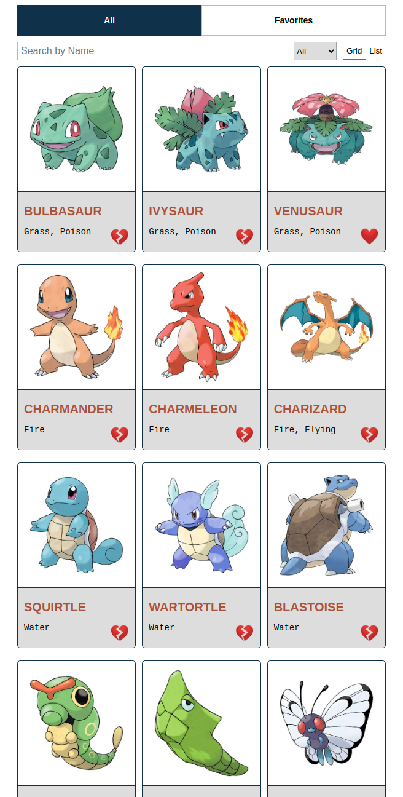
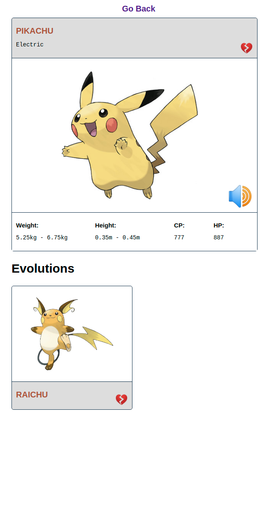

# Coding Exercise Frontend

This repository contains the coding exercise requested for evaluation using Vue.

### Changelog / Updates made: https://www.youtube.com/watch?v=qn-l7fq9QKA

- ✅ Update to include Loading States and Error States
- ✅ Adding 404 page for missing or not found Pokes
- ✅ Fix to Infinite Scroll Loading
- ✅ Caching and State perserving in localcache (for now)
- ✅ Toast Notifications using "vue-toast-notifications"

Still to do:

- graphql variables in queries

## Here is what I built

A demo video can be found in the example folder in the root of the directory as `demo.mp4` and here https://youtu.be/gevHu0oSmlM

|         List View          |         Detail View          |
| :------------------------: | :--------------------------: |
|  |  |

## Features

- ✅ Search for Pokemon by text through use of a search bar.
- ✅ Filter Pokemon by type using a dropdown.
- ✅ Add and remove a Pokemon to and from your Favorites by clicking the heart icon.
- ✅ Use tabs to switch between `All` Pokemon and `Favorite` Pokemon views.
- ✅ Change the view from either a grid or list.
- ✅ View Pokemon details using a `/:name` route.
- ✅ Clicking on a Pokemon image or name should navigate to the above route to view the Pokemon details.
- ✅ On the Pokemon details page, have a speaker icon that, when clicked, plays the sound of that Pokemon.

- ✅✅ _Infinitely scrolled or paginated list to handle on-demand data-fetching for the long list of Pokemon!_
- ✅✅ _recursive components in the details view to show the evolution cards_

## Steps to run locally

### Backend (`/backend`)

Start the local server or set the environment variable _"POKE_API_BASE_URL"_. The default value for POKE_API_BASE_URL is "http://localhost:4000/graphql".

To run the local server:

```
$ cd backend
$ npm install
$ npm start
```

### Frontend (`/frontend`)

To run the frontend:

```
$ cd frontend
$ npm install
$ npm run serve
```

While incomplete, to run the frontend end-to-end tests:

```
$ cd frontend
$ npm install
$ npm run test:e2e
```

Access the application at http://localhost:8080/.

### Technology and boilerplate

- [Vue](https://vuejs.org/)
- [Vue Router](https://router.vuejs.org/)
- [Axios](https://github.com/axios/axios) - Used to make calls to the graphQL server.
- [Vuex] (was not used)
- [Vue Apollo] (was not used)

I did not use any other libraries or CSS frameworks, but added some very simple animations to the calls to action on hover.
